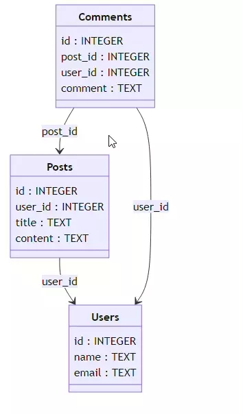

# SqliteToMermaidJS

## Overview

SqliteToMermaidJS is a Python script for generating MermaidJS diagrams from SQLite database schemas. It extracts the table structure and relationships from an SQLite database and converts them into an interactive MermaidJS diagram.



Certainly, I'll break down the installation instructions into detailed subsections with explanations and provide Windows alternatives where applicable.

## Installation

### 1. Clone the Repository

First, you need to clone the SqliteToMermaidJS repository from GitHub. This step downloads the project's source code to your local machine.

```sh
git clone https:/github.com/SqliteToMermaidJS.git
```

**Alternative:** You can use Git Bash or the GitHub Desktop application to clone repositories. The command remains the same.

### 2. Navigate to the Project Directory

Change your current working directory to the newly cloned repository. This step is necessary to access and work with the project's files.

```sh
cd SqliteToMermaidJS
```

### 3. Create a Virtual Environment

Creating a virtual environment is a best practice to isolate project dependencies. It ensures that the required packages won't interfere with other Python projects on your system.

```sh
python -m venv .venv
```

### 4. Activate the Virtual Environment

Activating the virtual environment allows you to work within the isolated environment where you can install project-specific packages without affecting your global Python installation.

```sh
source .venv/bin/activate
```

On Windows, use the following command to activate the virtual environment in Command Prompt:

```sh
.venv\Scripts\activate
```

### 5. Install Required Dependencies

Finally, you need to install the project's required Python packages, as listed in the `requirements.txt` file. This ensures that your environment has all the necessary libraries to run SqliteToMermaidJS.

```sh
pip install -r requirements.txt
```

## Usage

To use SqliteToMermaidJS in your project:

1. Import the `SqliteToMermaidJS` class from `SqliteToMermaidJS.py`.
2. Initialize the class with the path to your SQLite database.
3. Call the `generate_schema_diagram` method to create the diagram.

Example:

```python
from SqliteToMermaidJS import SqliteToMermaidJS

# Initialize SqliteToMermaidJS with the path to your SQLite database
converter = SqliteToMermaidJS("path_to_your_database.db")

# Generate the schema diagram and store the HTML output
html_output = converter.generate_schema_diagram()

# Save the HTML output to a file (e.g., "schema_diagram.html")
with open("schema_diagram.html", "w") as html_file:
    html_file.write(html_output)
```

## Project Structure

- `templates/`: Contains the Jinja2 template.
- `tests/`: Unit tests for the SqliteToMermaidJS.
- `examples/`: Example scripts demonstrating the usage of the tool.

## Contributing

Contributions to the SqliteToMermaidJS project are welcome. Please follow the standard fork-and-pull request workflow.

## MIT License

Copyright (c) 2023 Blaiselabs

Permission is hereby granted, free of charge, to any person obtaining a copy
of this software and associated documentation files (the "Software"), to deal
in the Software without restriction, including without limitation the rights
to use, copy, modify, merge, publish, distribute, sublicense, and/or sell
copies of the Software, and to permit persons to whom the Software is
furnished to do so, subject to the following conditions:

The above copyright notice and this permission notice shall be included in all
copies or substantial portions of the Software.

THE SOFTWARE IS PROVIDED "AS IS", WITHOUT WARRANTY OF ANY KIND, EXPRESS OR
IMPLIED, INCLUDING BUT NOT LIMITED TO THE WARRANTIES OF MERCHANTABILITY,
FITNESS FOR A PARTICULAR PURPOSE AND NONINFRINGEMENT. IN NO EVENT SHALL THE
AUTHORS OR COPYRIGHT HOLDERS BE LIABLE FOR ANY CLAIM, DAMAGES OR OTHER
LIABILITY, WHETHER IN AN ACTION OF CONTRACT, TORT OR OTHERWISE, ARISING FROM,
OUT OF OR IN CONNECTION WITH THE SOFTWARE OR THE USE OR OTHER DEALINGS IN THE
SOFTWARE.
